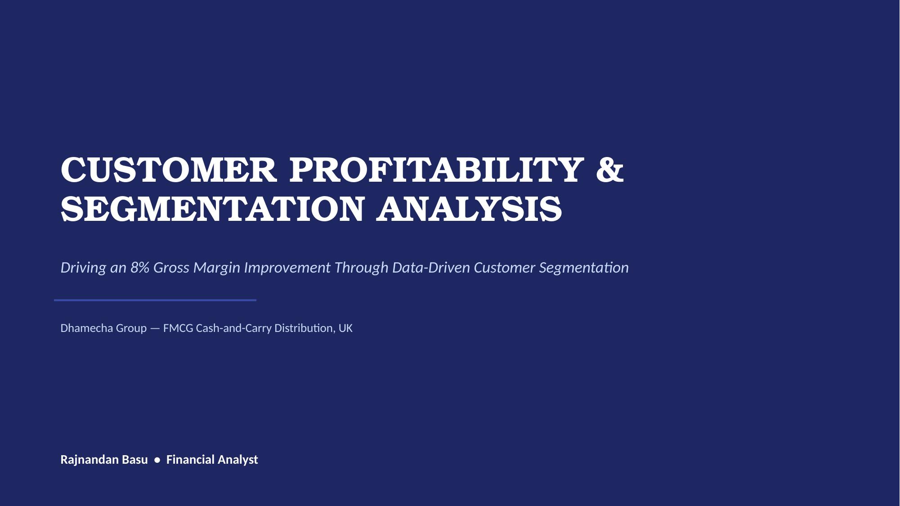
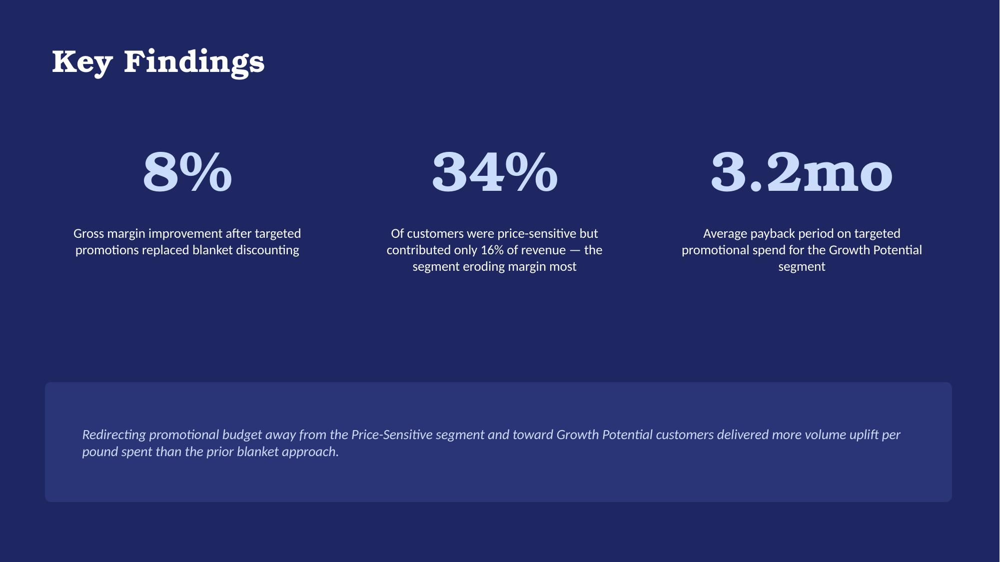

# Business Case Study: Customer Profitability & Segmentation Analysis

## Business Problem
Management needed to know whether uniform, blanket promotional discounting across the entire customer base was helping or hurting margin — and if targeted promotions based on customer value would perform better.

## Dataset
12 months of transactional sales data across the full Dhamecha Group customer base, segmented by purchase frequency, order value, and product mix.

## Tools Used
Excel (Power Query, Power Pivot) for segmentation and profitability analysis; NPV/payback modeling for promotional scenario testing.

## Key Insights
- **8% gross margin improvement** after replacing blanket discounting with targeted, segment-based promotions
- **34% of customers were price-sensitive but contributed only 16% of revenue** — the single segment responsible for most of the margin erosion
- **3.2-month average payback period** on targeted promotional spend for the Growth Potential segment

## Presentation Preview

| Metric | Before | After | Change |
|---|---|---|---|
| Gross Margin % | 34.2% | 37.0% | +2.8pp |
| Promotional Spend | £185,000 | £162,000 | -12.4% |
| Revenue from Promotions | £720,000 | £810,000 | +12.5% |
| Net Margin Contribution | £246,000 | £300,000 | +£54,000 |

## Skills Demonstrated
- Data-driven customer segmentation
- Financial modeling (NPV/payback analysis)
- Commercial business partnering — translating analysis into an executable strategy

## Files
- `customer-profitability-case-study.pptx` — full 8-slide presentation
- `case-study-title.jpg`, `case-study-findings.jpg` — slide previews

## Note
This case study documents the methodology and impact behind a real achievement referenced on my CV: *"Performed customer segmentation and profitability analysis to support targeted promotions, delivering 8% gross margin improvement."*
